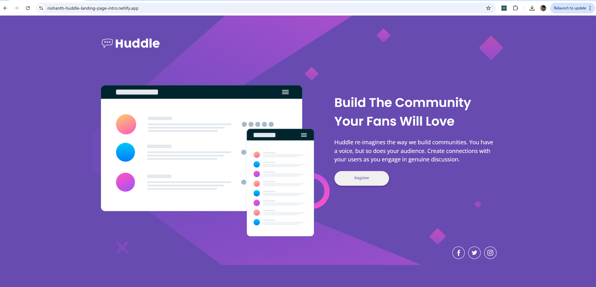

# Frontend Mentor - Huddle landing page with single introductory section solution

This is a solution to the [Huddle landing page with single introductory section challenge on Frontend Mentor](https://www.frontendmentor.io/challenges/huddle-landing-page-with-a-single-introductory-section-B_2Wvxgi0). Frontend Mentor challenges help you improve your coding skills by building realistic projects.

## Table of contents

- [Overview](#overview)
  - [The challenge](#the-challenge)
  - [Screenshot](#screenshot)
  - [Links](#links)
  - [Features](#Features)
  - [Installation](#Installation)
- [My process](#my-process)
  - [Built with](#built-with)
  - [Continued development](#continued-development)
  - [Useful resources](#useful-resources)
- [Author](#author)
- [Acknowledgments](#acknowledgments)

## Overview

### The challenge

Users should be able to:

- View the optimal layout for the page depending on their device's screen size
- See hover states for all interactive elements on the page

### Screenshot




### Links

- Solution URL: [Solution URL]()
- Live Site URL: [Live site URL]()

### Features

- **Responsive Design**: The card layout adapts seamlessly from mobile to desktop view.
- **Dynamic Content**: Components are reusable, making it easy to extend the functionality or update the content.

### Installation

To run this project locally:

1. Clone this repository:

   ```bash
   git clone https://github.com/yourusername/order-summary-card.git
   ```

2. Navigate into the project directory:
   cd order-summary-card

3. Install dependencies:
   npm install

4. Start the development server:
   npm run dev

5. Open the project in your browser at http://localhost:5173

## My process

### Built with

- Semantic HTML5 markup
- CSS custom properties
- Flexbox
- Mobile-first workflow
- [React](https://reactjs.org/) - JS library

### What I learned

In this project, I learned how to use different background images for mobile and desktop versions, optimizing the layout for both screen sizes. One challenge I encountered was when my styles weren’t reflecting as expected in the middle section of the page.

After inspecting the issue in the browser’s developer tools, I discovered that while my styles were being applied, a higher-priority style was overriding them. Once I identified the source of the conflict, I was able to resolve it effectively.

This process taught me valuable debugging skills and how to troubleshoot CSS conflicts, which is crucial for creating more efficient and maintainable code in the future.

### Continued development

I would also like to continue practicing more complex layout techniques, especially working with Flexbox and Grid

### Useful resources

MDN Web Docs - Flexbox - This documentation helped me understand Flexbox better.
Google Fonts - I used the Poppins and Open Sans font from Google Fonts to style the text.

### Author

- Name: Nishanth
- Website - [My GitHub Profile](https://github.com/nishanth1596)
- Frontend Mentor - [@nishanth1596](https://www.frontendmentor.io/profile/nishanth1596)
- Twitter - [@nishanth1596](https://x.com/nishanth1596)

### Acknowledgments

A special thanks to the Frontend Mentor community for providing inspiration and feedback on this project. The resources provided by the platform were very helpful in getting me to the solution.
